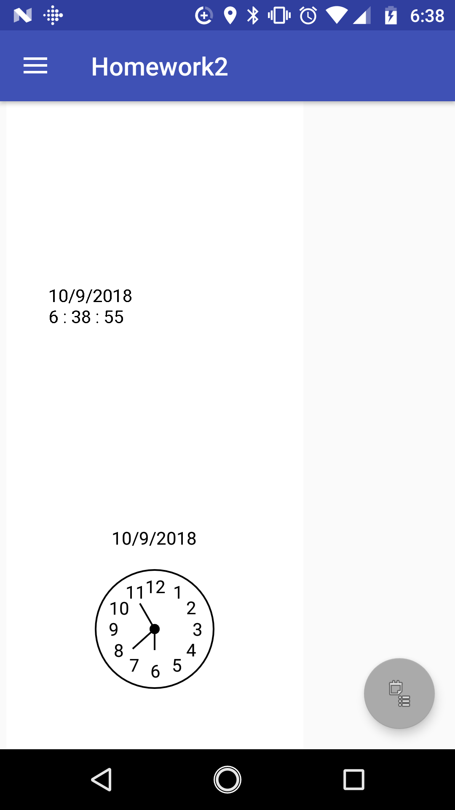
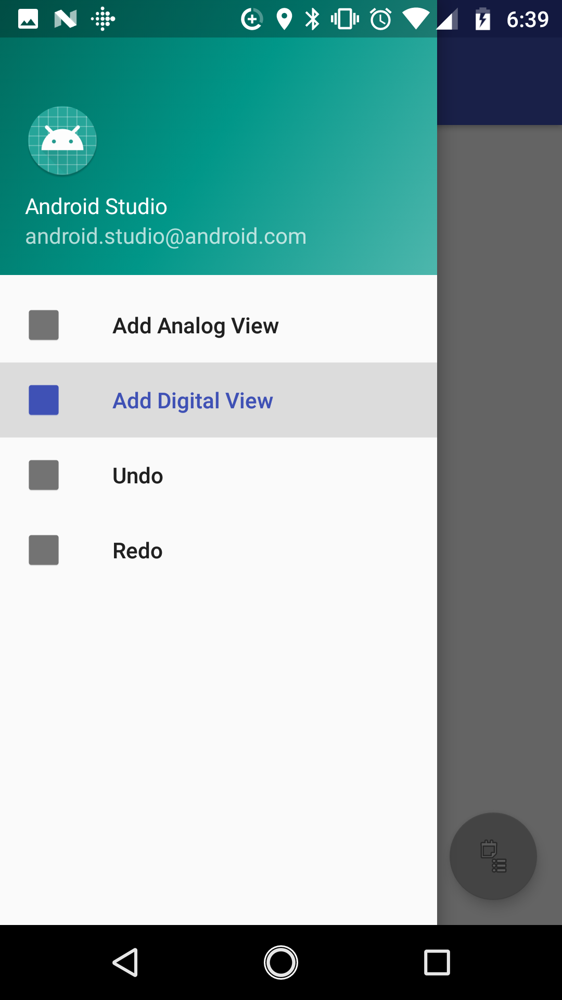
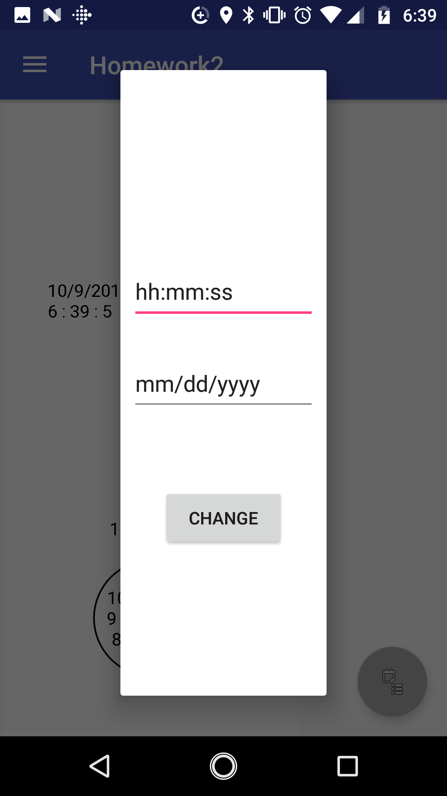

# CEG 6110 Homework 2
Homework #2 Assignment for CEG 6110

This Android app was designed and created for Homework Assignment #2 for CEG 6110 using Android Studio. This app features an interactive
User Interface (UI) in which the user is able to add two different types of clocks to the screen. Each clock maintains the time and date
and allows the user to change the time and day to any of their choosing.

## Getting Started

  1. Download .zip folder from GitHub
  2. In Android Studio, import a new project ```File->New->Import Project```
  3. Select the zipped folder and click ```Next ->Finish```

  ### Prerequisites

  This app requires an Android environment of at least Android 6.0 Marshmallow on the targeted device.

  ### Installing

* Running in Android Studio
  1. Import the project into Android Studio
  2. Connect an Android device to the computer via USB cable
  3. Enable USB debugging in the Developer Options as follows:

      a. Open the Settings app
      
      b. Select System (Android 8.0 or higher)
      
      c. Scroll to the bottom and select About Phone
      
      d. Scroll to the bottom and tap Build Number 7 times
      
      e. Return to the previous screen to find Developer Options near the bottom
      
      f. Open Developer Options, then scroll down to enable USB debugging
      

   4. In Android Studio, click the app module in the Project window and select Run in the toolbar
   5. Select your device in the Deployment Target window and click OK


* Running on Android Device

  1. Download and unzip project folder from GitHub
  2. Connect Android device to computer via USB cable and enable file sharing
  3. Copy the release APK from the release folder within the root directory of the project into a desired folder on the Android Device
  4. Using the Android Device, click the APK file and give the app permissions to install

## Deployment

Once installed onto the Android Device, the Homework2 app can be deployed through the device's app menu by clicking on its icon.

### Note

If issues are experienced during installation, make sure that the Android device is able to install apps from Unknown Sources. This
setting can be changed at ```Settings->Security``` and checking the option under Device Administration.

### Using the App

This app allows a user to add clocks, digital or analog, to the main layout of the app. As clocks are added, the user is able to scroll
on the main body of the app. 



Clocks can be added by swiping to the right or clicking on the menu button in the upper left-hand corner of the app. This menu gives the user the option of adding an analog clock, digital clock, or to undo or redo any actions. 



The date and time of the clocks can be manually set to any date or time by clicking on the floating button in the bottom right-hand corner of the app. Here, there are two textboxes with the desired format example set as an example. The user can enter their desired dates and times, select the change button, and the clocks will update to the entered information.



###### Note

The user will need click on these menu buttons once before choosing an option, eg. click "Add Analog View", allow the menu to close, reopen the menu, and select this option again before the clock is opened. Once a clock of that type has been added, the user can simply select to add a clock once.

### Design

This app was designed using the MVC and Command Design Patterns.

* MVC Design Pattern

  The MVC Design Pattern was used to better allow for uniform updates to be performed across all of the views simultaneously. Using an MVC also reduced the amount of code necessary to make the views function. Since the views and model are separated by a controller, it is possible to change the views, or in this case add multiple views, without changing the model. The same, singular model is used to update both views from the main class. It should be noted, however, that two controllers were used, one for the digital views and one for the analog views, as it was necessary to track the number of each type of view so that the proper XML could be inflated.

  There were a series of classes created for the MVC.
    * Clock :
        * This class acts as the model for the MVC. It has two constructors, one using Java's Calendar to set the clocks to the current time and date and one using a Clock object. The constructor that requires a Clock object be passed allows for deep copies of Clock objects to be created.
    * ClockController:
      * This class acts as the controller for the MVC. It communicates with the views using data passed from the model.
    * ClockView:
      * This class is the abstract class for the views created for the MVC. It contains all of the classes used by all of the views.
    * AnalogView:
      * This class extends the ClockView abstract class and draws the analog clock displayed in the Analog Clock View. This class uses an extra method to draw the hands for the clock.
    * DigitalView:
      * This class extends the ClockView abstract class and draws the digital clock displayed in the Digital Clock view.


* Command Design Pattern

  The Command Design Pattern was used to encapsulate the function of the undo and redo capabilities in classes. By doing this, these commands can be used across views. This design pattern is also ideal for the undo/redo functionality.

  There were two classes created for the Command Design Pattern.

  * Command:
    * This class is the interface for the Execute class.
  * Execute:
    * This class implements the Command interface and contains the undo and redo functions. This is where the functionality of the undo and redo occur. These actions require the use of stacks, where clock objects are pushed or popped. There exist two stacks, one for undo actions and one for redo actions, and the functions move the clock objects between stacks as necessary to complete the desired actions endlessly.

##### Thoughts and Problems
This app was assigned for the use of design patterns. The design patterns were overall very useful to the logic necessary to make the app work, particularly the Command Design Pattern. I see the benefit in using an MVC when looking at modularity but I had considerable trouble implementing it.

I began designing this app by first ensuring I could create the views properly and then I moved logic accordingly to make it fit the MVC Design Pattern. I was easily able to create any number of views that updated appropriately when the logic to do so was maintained in the view classes, but when I began moving the logic outside of the views the views stopped behaving correctly. I was unable to get my Calendar object to update regularly, so I ended up using a thread that updated every second and adding logic to update the times of the clocks. I was also no longer able to inflate any number of views and only one view of each time was being displayed with the correct time and date, all others were set to null. My only remedy to this problem, which I narrowed down to be a symptom of inflating the same XML layouts under the same IDs, was to create multiple copies of the same XMLs and assign each new clock a different XML. As a result of this, the user will only be able to add 3 functioning clocks of each type to the main layout. 

### Built With

* [Android Studio](https://developer.android.com/studio/)

### Authors

* **Brittany Woods** - *Initial work* -
[w029bnw](https://github.com/w029bnw)

### Acknowledgements

* A tutorial created by Khairul Alam Licon was used to learn how to create an Analog Clock View.
  * https://viblo.asia/p/simple-way-to-create-a-custom-analog-clock-in-android-1VgZv9aRKAw
